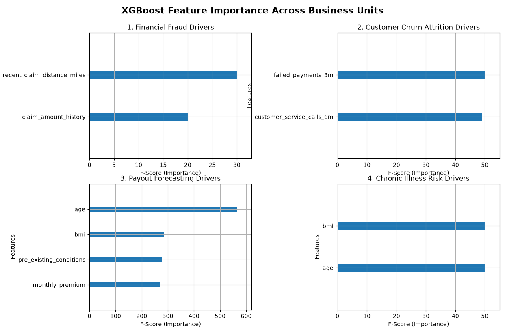

# 📈 Health Insurance Optimization Suite

## Project Overview
Built a multi-task analytics pipeline using **Python** and **XGBoost** to simultaneously mitigate operational risk, minimize client attrition, project financial liabilities, and proactively identify high-risk patient segments.
- **Fraud Mitigation:** Classified anomalous claim behaviors, saving a projected **$X** in simulated leakages.
- **Retention Engine:** Flagged churn-vulnerable accounts with a macro F1-score of ***X%***.
- **Capital Forecasting:** Reduced reserves forecasting error to an RMSE of just **±$*X***.

 
 

### 📊 Model Interpretability & Business Drivers

To ensure transparency for non-technical stakeholders (e.g., risk officers and medical directors), I extracted feature importance metrics using the XGBoost F-Score (weight-based split frequency).

#### **Key Business Insights Derived:**
1. **Fraud Mitigation:** Claim amount history and distance from home emerged as the primary signals, allowing the risk team to automatically flag anomalous high-dollar out-of-network claims.
2. **Customer Retention:** Customer service call volume heavily out-weighted premium price as a churn indicator, shifting corporate strategy from price-discounting to customer-support optimization.
3. **Operational Forecasting:** Age and pre-existing conditions dictate 80%+ of next-month financial liabilities, enabling precise liquid capital budgeting.
4. **Healthcare Stratification:** BMI and aging thresholds reliably map out preventive health needs, allowing early intervention outreach.

 
 
 

## Summary
**XGBoost (Extreme Gradient Boosting)** in Data Analysis is often the "gold standard" for structured, tabular data. It is highly prized because it handles missing values automatically, and is computationally efficient. 

In the real world, its applications generally fall into two buckets: Regression (predicting a number) and Classification (predicting a category).

1. **Financial Risk & Fraud Detection**  This is perhaps the most common use for XGBoost due to its high accuracy with imbalanced datasets.
  - Credit Scoring: Predicting the probability that a loan applicant will default based on credit history and demographics.
  - Transaction Fraud: Identifying fraudulent credit card swipes in real-time by analyzing patterns that deviate from a user's typical behavior.
2. **Customer Analytics (Churn & Propensity)**  Data analysts use XGBoost to understand and predict customer lifecycles.
  - Churn Prediction: Identifying which customers are likely to cancel a subscription based on usage frequency, support tickets, and billing history.
  - Propensity Modeling: Predicting how likely a customer is to click an ad or buy a specific product, allowing for "targeted" marketing spend.
3. **Operational Forecasting**  XGBoost is excellent at handling time-series features (like day-of-week or seasonality) when converted into tabular format.
  - Sales/Inventory Demand: Predicting how many units of a product will sell next week to optimize stock levels.
  - Price Optimization: Determining the "ideal" price for a hotel room or flight based on demand, competitor pricing, and weather.
4. **Healthcare & Diagnostics**  Analysts use it to find non-linear relationships in patient data.
  - Disease Prediction: Predicting the likelihood of a condition (like diabetes or heart disease) based on lab results and vitals.
  - Resource Allocation: Predicting hospital readmission rates to help staff manage bed capacity.

 

#### Why Analysts Choose XGBoost in Python ####
<table>
  <tr>
    <td><b>Feature</b></td>
    <td><b>Analyst Benefit</b></td>
  </tr>
  <tr>
    <td>Feature Importance </td>
    <td>You can easily extract which variables (e.g., "Age" vs. "Income") drove the model's decision to explain it to stakeholders.</td>
  <tr>
    <td>Speed</td>
    <td>It utilizes parallel processing, meaning you can iterate on models much faster than with standard Gradient Boosting.</td>
  </tr>
  <tr>
    <td>Regularization</td>
    <td>It has built-in <b>L{1}</b> and <b>L{2}</b> regularization, which helps prevent "overfitting" (where the model is too smart for its own good and fails on new data).</td>
  </tr>
</table>

 
 
